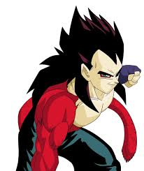
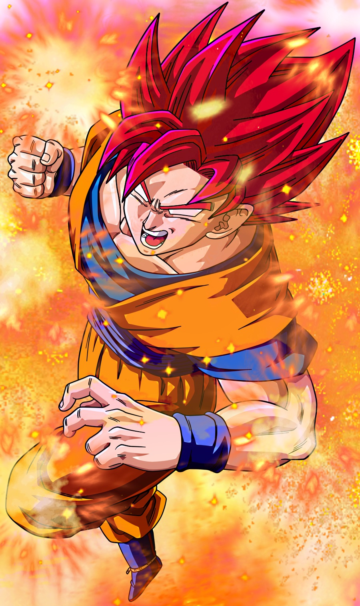

# Super-Saiyan-classifier
Distinguish between Super Saiyan 1,2,3,4 and god using this deep learning model!

I used Google's Inception (2015) model. Inception is a deep convolutional neural network built for classifying real world images of thousand categories.

Input to the model: A picture file.

Output of the model: Probability distribution of each saiyan forms.

I retrained it by replacing the Inception's last layer with my Super Saiyan layer.
Let's see whether or not features in real world are useful for classifying anime
forms!

**This model is about 83 MB big in file size.** You can roughly interpret it as
the brain of the classifier.

I trained it with 388 images of Super Saiyan Goku, Vegeta and their sons.
That's only a few images, so don't expect good accuracy from this classifier.

## Repository structure

You can take a look at the training images in the **super_saiyan_forms** folder.

You can use some images inside  **test_images** to test this model's prediction.
Or go find some images yourself.

## Getting started
1. Clone and run bash on this repository. (Ensure that you have TensorFlow installed.)
2. Then run `python label_saiyan.py test_images/vegeta_saiyan4.jpg`
3. Wait for the model's prediction.

4. Here's the result you should expect if things work correctly:
```
super saiyan 4 (score = 0.81662)
super saiyan 1 (score = 0.06831)
super saiyan 3 (score = 0.05949)
super saiyan god (score = 0.04132)
super saiyan 2 (score = 0.01425)
```

### Congratulations!
Now you know that this Vegeta is surely a Super Saiyan 4 because the model
predicted with 81% confidence!




Here's another prediction with our beloved Goku. I don't even know how to
classify this myself because I haven't watched Dragonball Super yet!


Goku's Result:
```
super saiyan god (score = 0.67520)
super saiyan 3 (score = 0.18979)
super saiyan 2 (score = 0.06863)
super saiyan 4 (score = 0.04908)
super saiyan 1 (score = 0.01730)
```
Not so surprising right? It's a Super Saiyan God Goku!

But The model isn't sure (like me).
It says 67% confidence to be safe.

## What's next
Try changing the image and see the new result yourself.

Super Saiyan 4 is easy to distinguish but Super Saiyan 1 and 2 is somewhat
troublesome!

Also try to fool the model ! Learn something from it.
